# LlamaVoice

LlamaVoice is an innovative, Llama-based model for large-scale voice generation. It takes a novel approach by predicting continuous features directly, offering a more streamlined and efficient process compared to traditional models that rely on vector quantization for discrete speech code prediction.

## Model Architecture

The following diagram illustrates the architecture of LlamaVoice:

```mermaid
graph TD
    text([Text]) --> bbpe(Tokenizer)
    bbpe --> model(Llama)
    Voice_prompt([Prompt Voice]) --> speech_encoder(Voice Encoder) --> model
    model --> linear(Linear) --> stop([Stop])
    model --> dist1([LLM distribution])
    dist1 <--> | KL| flow(Flow) <--> dist2([VAE distribution])

    wav2([Target Voice]) --> speech_encoder --> dist2 --> v(Voice Decoder) --> wav3([Generated/Reconstructed Voice])

```



## Key Features

- **Continuous Feature Prediction**: LlamaVoice predicts continuous features directly, bypassing the need for vector quantization and resulting in a more efficient process.
- **VAE Latent Feature Prediction**: Unlike models that predict mel-spectrograms, LlamaVoice predicts Variational Autoencoder (VAE) latent features, enabling more flexible and expressive voice generation.
- **Joint Training**: The VAE and Large Language Model (LLM) are trained together, simplifying the training procedure and enhancing overall performance.
- **Advanced Sampling Strategy**: LlamaVoice implements a novel sampling strategy on the predicted distribution, resulting in more diverse latent representations.
- **Flow-based Enhancement**: Utilizes flow-based models to make the latent space more amenable to prediction by the LLM, improving the quality and consistency of generated voices.

## Installation

To get started with LlamaVoice:

1. Clone the repository:
   ```sh
   git clone https://github.com/OpenT2S/LlamaVoice.git
   ```

2. Navigate to the project directory:
   ```sh
   cd LlamaVoice
   ```

3. Install the required dependencies:
   ```sh
   pip install -r requirements.txt
   ```

## Usage

Generate voice samples with LlamaVoice using the following command:

```sh
python generate_voice.py --input_text "Your text here"
```

For comprehensive usage instructions and additional options, please refer to our [detailed documentation](docs/usage.md).

## Contributing

We welcome contributions to LlamaVoice! Whether you have suggestions, bug reports, or feature requests, please don't hesitate to open an issue or submit a pull request.

